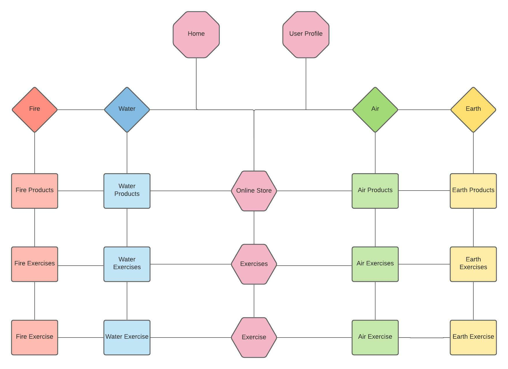
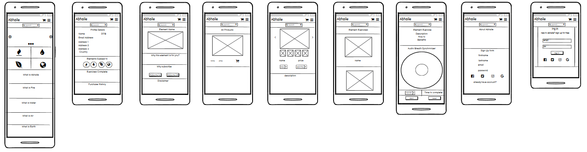
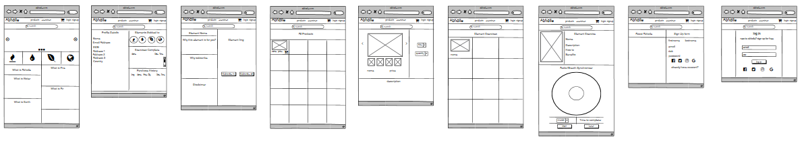
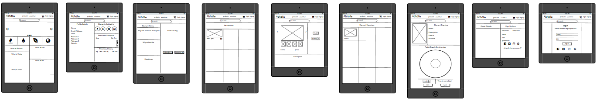
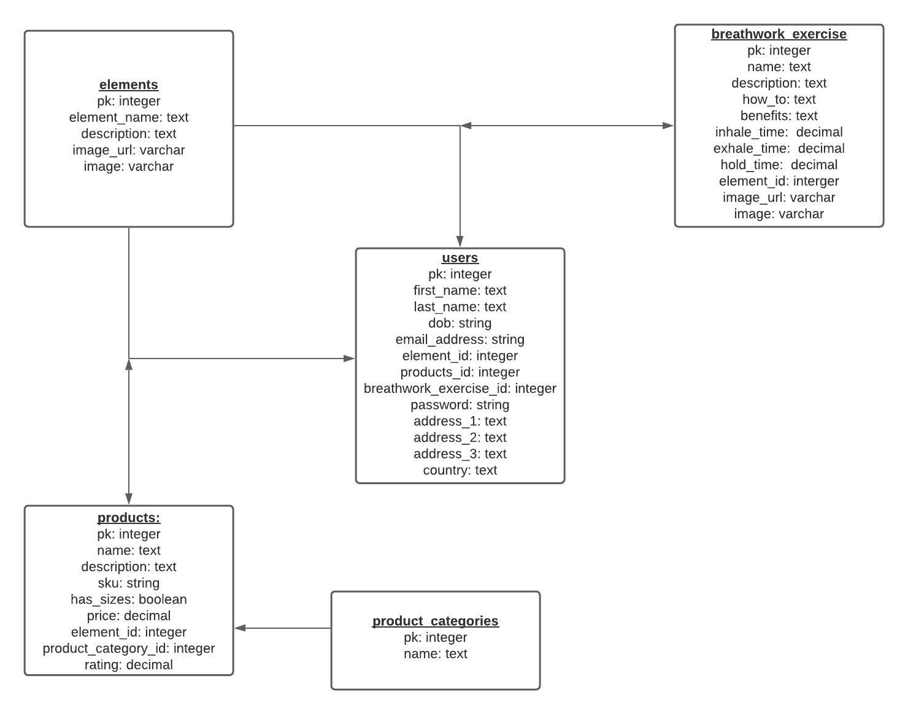

# Project Name - Abhaile

17/10/2021  
The purpose of Project Abhaile is to create a wellness/wellbeing app that allows users to subscribe to different aspects (or all aspects) of the app based on their wellbeing needs. 
The initial stage of Project Abhaile will focus on breathwork, the benefits of breathwork and allow users to utilize different breathwork in their day to day lives in an app environment that is equal parts calming and engaging. 
The 4 different parts of Project Abhaile will be the following:
-	Fire
-	Water
-	Earth
-	Air

These 4 elements will essentially house the different breathworks. The user can opt to each individual element.
The elements are associated with the following benefits:
-	Fire = Energy/Adrenaline/Burst/Red
-	Water = Intelligence/Focus/Creativity/Blue
-	Earth = Physical/Physical health benefits/Green
-	Air = Meditiation/Spirituaility/Balance/Mental Wellbeing/Destress/Yellow

By opting to an element, gives the user full access to all the different exercises associated with that element.
There will be an online store selling merch dedicated to each element. This online store will be open to all users. 
Eventually I would like to add more exercises that will improve wellbeing across the different elements that go outside the scope of breathwork. This may happen after this project. In addition I would like to add a subscription element where users can subscribe to the element they feel they are lacking in their life. This may come post MS4

## Table of Contents:

- [UX](#ux)  
- [Features](#features)  
- [Technologies Used](#technologies-used)  
- [Testing](#testing)  
- [Deployment](#deployment)  
- [Credits](#credits)  

## Message to Examiner

Hello.

This app takes 2 different users. Admin User and Regular User. 

Below are the admin login details:

Username: admin4000  
Password: Test123!"£

With admin user you can add, edit and delete various products and exercises to and from the site. 

Sign up regularly to become user and get access to exercises on site. 

If you are wanting to try any/all of the exercises, feel free. However please view disclaimer on exercise pages to see if you are able. 

All the Best  
Cathal

## UX

The UX for this project will be investigated through the following 5 planes:

### Strategy Plane:  

Why are we special? Who are competitors? What are they doing? – There are multiple apps that offer wellness and wellbeing services to its users. The main apps that do this are Headspace and Calm. Both are essentially meditation apps that aim to destress and unwind their users and promote wellness. 

How Abhaile will differentiate from this is that it focuses on the different breathworks that aim to destress its users but also teach users various breathworks to improve energy, focus and physical wellbeing in addition to mental wellbeing within the user. All power comes from within so the aim of Abhaile is to bring this out of its users. 

Tech considerations?  
The purposes of this assignment is to build out an App using Python primarily through the Django framework and integrate Stripe payments. However, like all good apps,  this is built with mobile in mind. I will be building this from Mobile view out to desktop. 

Why would a user want this?  
Purpose of this app is to promote wellness and emotional improvement for its users through breathwork.

Who is my target audience?  
- The targeted demographic is incredibly broad. I want the only tools necessary to complete any exercise on this app to be the user and the app. After this, the user can be anyone trying to better themselves or trying to unwind and destress

- Project Abhaile is for general consumers but ideally(eventually) would like to see this app adopted by businesses/organizations to help its employees 

For Consumers:  
- Like any wellness app, consumers want an engaging experience that doesn’t feel like it’s a chore to access the app and participate in the exercises. The goal of the app is to give its users enough value to repeatedly come to the app on a daily basis 
- A good ecommerce experience for users is to make the shopping and buying experience as seamless as possible and with as few steps as possible to make a purchase. 
-  For this app, the user will be brought to home page. On homepage there will be 4 different tiles that have Fire, Water, Air and Earth. By hovering on each tile shows to user why one would want to subscribe to this element. 
-  A good experience would be one that is rewarding upon every use. In addition, good experience is one that is seamless and effortless. You do not want to be dreading the experience or putting it off. If this app is designed well, users would want to make this app a part of their day to day life
- As this app is a wellness app, users will mainly use this to feel well and motivated. This can be if user has experienced a tough day and needs to destress or needs to complete a task/project and needs to focus or improve concentration. 
- Before engaging, user will need to consult their doc/gp before undergoing. If this app was to ever reach market in real life, all the practices would need to be medically cleared as this is holistic science, its practices are still more pseudo than factual
- After using, user would ideally feel the benefits immediately after practicing. 

For Businesses:  
- The aim of Project Abhaile is to help promote stress management within working environments. The end goal is to have an application that is the go to for businesses/organizations that want to help their employees wellbeing.  

 

What's worth doing?

Opportunity/Problem | Important | Feasability/Viability 
--- | --- | ---
Sign Up and Log in Feature | 5 | 5 |
Social media sign Up and log in Feature | 2 | 2 
Ecom website that presents products and allows card transactions | 5 | 5 
Customer sign up | 5 | 5
Exercises only available to Abhaile users | 5 | 5
Products page  | 5 | 5
Product page properly displays product image in engaging way | 5 | 3
Exercise page | 5 | 5
Breath synthesizer that matches up with the breath work  | 5 | 3
XP System | 1 | 2
Stripe Payment System | 5 | 5
Search functionality | 5 | 5
Round system | 4 | 3
Mp3 looped audio | 1 | 3
Admin access to add, edit and delete products | 5 | 5
Admin access to add, edit and delete exercises | 5 | 5
Youtube follow along links in case user cant use breath sync | 5 | 5
Product and Exercise carrousel that appears on element page | 1 | 1

		

 

What are we making in the first place?  
We are making an app that helps to promote wellness and peace for its users. 
The goal is to have a wellness app that is equal parts fun, engaging and calming. From past experience, meditation and anything similar are difficult to repeatedly do. Other people who attempt to preach this practice state that the difficulty is due to the users subconcious not wanting to go through the changes associated for meditation as your mental state does change during such activities. To combat this might go outside the scope of this project but sure we will give it a go. 

A compelling user experience with any app is the ability to leave the user wanting more. In the instance of Project Abhaile, this may take up the shape of levels starting off on beginner exercises and progressing with the user. The more they participate, the more they will level up unlocking new and more difficult challenges. This again might be outside scope of project but something worth considering. 

Initially these exercises will be freely available to all users. Taking inspiration from Andrew Chens book, The Cold Start problem, it is beneficial at early stages of app deployment that offers a service to be free to improve Network Effects and in turn improve business growth. Eventually I would like to add some sort of subscription system where users subscribe to individual elements and then reap the benefits of said element through new exercises and potential store discounts. This will be post MS4

In addition, if the elements take off as concepts they will double as advertising for the procucts in store. 

How is our offering, or proposed offering, different from our competitors and substitutes?  
The difference in offering can be split into short term and long term. Short term is that I don’t think anyone else is separating the wellbeing into the categories of energy(fire), intelligence(water), mindfulness/enlightenment(air) and physical wellbeing (earth). Being able to succinctly tap into the element you want more of for that instance isn’t a concept I believe that has been explored too much by other wellness apps. Long term, my endgoal for this app is that it is something that is provided to everyone by the Government as it is seen as very beneficial to help people cope and succeed in their everyday lives (maybe too ambitious). Eventually I would like more exercises that fall in line with the aforementioned categories that go beyond scope of breathwork. An encyclopadia/catalogue of wellness practices to help people. 

What can the user expect?  
User can expect an app that will be a massive benefit to them and the way they feel and their outlook on life. 

 

### Scope Plane:

 

Whats on the table?
- Sign Up and Login (through social media account)
- Customer sign up
- Online, ecom store that allows purchasing or merch from site. Merch to include bracelets, t-shirts, jumpers, hoodies, books, etc. 
- Search functionality 
- Stripe System
- Breath syncronizer that matches up with the breath work 
- Level up system that aims to encourage user to keep participating in the exercises. (user gains xp per exercise. By completing an exercise they gain certain amount of xp depending on factors such as difficulty and consistent logins)
- Profile page that highlights what elements user has subscribed to, exercises complete to date and purchases made thus far. 
- Round system that allows users to select how many rounds of work they would like to do
- Mp3 looped audio added to create ambiance associated with that element ie air mp3 may incorporate wind chimes and so on. 

User Stories:
-	As a new user, I want to be able to know the layout of the app easily so that I can navigate the app with ease and avoid frustration
-	As a new user, I want to be able to know what the different elements mean so that I can make an informed decision on what element I want to go with
-	As a new user, I want to be able to know why I should join and decide whether this is the app for me
-	As a new user, I want to be able to easily sign up
-	As a new user, I want to be able to follow along to video of exercise in case I do not understand
-	As a new user, I want to be able to browse the online store easily so that I can purchase something I like. 
-	As a new user, I want to be able to better view the product on offer through multiple images so I know what I am buying.
-	As a new user, I want to be able to better view cart prior to checking out
-	As a new user, I want to be able to know how I can join so that I can make a better purchasing decision
-	As a new user, I want to be advised of the health risks involved so that I don’t die 

 

-	As an existing user, I want to have my info saved so that I can purchase items from site without needing to fill out my info again
-	As an existing user, I want to know about the different breathworks and the benefits associated with them
-	As an existing/new user, I want to be guided through my breathwork so that I can better understand and learn the different breathing techniques in an engaging environment. 
-	As an existing/new user, I want to be able to search appropriately so that I can better navigate and find the items I need. 
-	As an existing/new user, I want to be able to filter appropriately so that I can better navigate and find what I need. 
-	As an existing/new user, I want to be able to access my own profile and update my information as I see fit. 
-	As an existing/new user, I want to be able to access my own profile and and see my previous order history 

 

- As an admin user, I want to be able to add products to the site
- As an admin user, I want to be able to edit products on the site
- As an admin user, I want to be able to see preview images of products I am adding before submitting on edit/add products forms
- As an admin user, I want to be able to add exercises to the site
- As an admin user, I want to be able to edit exercises on the site
- As an admin user, I want to be able to see preview images of exercises I am adding before submitting on edit/add exercises forms
- As an admin user, I want to be able to restrict access to certain parts of site to incentivise new sign ups 

 

### The Structure Plane:
Different Pages:
- (1) Homepage,
- (2) User Profile Page 
- (3) Specific Element pages 
- (4) Product/s Page/s
- (5) Exercise/s Page/s
- (6) Sign Up
- (7) Login
- (8) Checkout

The below image provides the sitemap to Project Abhaile and illustrates the interconnecting parts:

### Skeleton Plane:
Mobile Wireframes

Desktop Wireframes

Tablet Wireframes

In addition to this, the following database mockups were done through [LucidChart](https://www.lucidchart.com/)

Database Mockups

### The Surface plane:

- Font: Fonts used were Alegreya Sans for headings and Khula for normal text. 

- Color: Main colors user were Orangered (fire), Dodgerblue (water), Khaki (air) and forestgreen (earth). Hotpink was used for loading screens overlay. 

## Features:

#### Final project features include:
- (1) Homepage,
    - (1.1) Allows user to see what Abhaile is about and pick an element to start with. 
- (2) Elements Pages
    - (2.1) Individual Element pages to display benefits of said element and exercises involved
    - (2.2) Group element page to show user all elements
- (3) Products Pages
    - (3.1) Individual Product pages to display individual product info and allow user to add to cart. 
    - (3.2) Group product page to show user all available products in store
    - (3.3) Admin access to add, edit and delete products from store
- (4) Exercises Pages
    - (4.1) Individual Exercise pages to display individual exercise info with built in breath sync
    - (4.2) Group exercise page to show user all available exercises
    - (4.3) Admin access to add, edit and delete exercises from app
- (5) Sign Up/Login page
- (6) Profile Page
- (7) Cart and Add to cart page
- (8) Checkout page with Stripe enabled

- Responsive across all devices
- Functional email send system sent from specially made email address for Project Abhaile. 

 

## Technologies Used 

Project Abhaile made use of the following technologies, languages and frameworks:

- HTML: To create structure of site

- CSS: To add styling and substance to project

- JavaScript: To bring front end interactivity to project.

- JSON: to store data in form of fixtures

- jQuery: A javascript library, used in conjunction with JavaScript to help deliver on set out features and goals when it comes to adding interactivity to the site.

- Python: To access Postgres, Django, Stripe, AWS and other frameworks and to develop the back end of the site. 

- Stripe: Used as payment processor for app

- Django: Framework used to create the various apps in Project Abhaile

- AWS: To remotely store all static and media files. 

- Heroku: Used to deploy the app. 

 

## Testing

Testing file can be found through the following [link](TESTING.md).

 

## Deployment

This was developed using Gitpod IDE, committed to git and pushed to GitHub using the built in function within gitpod. 

### How to run this project locally
To clone this project from Github:

1. Follow this link to [ShiftyKitty/MS-Abhaile](https://github.com/ShiftyKitty/MS4-Abhaile)
2. Above the list of files, click Code.
3. In the Clone with HTTPs section, copy the clone URL for the repository. 
4. In your local IDE open Git Bash.
5. Change the current working directory to the location where you want the cloned directory to be made. 
6. Type git clone and paste the URL copied in Step 3.
7. Press Enter. Your local clone will now be created. 

### How to deploy this project through Heroku
To deploy to Heroku, take the following steps:

1. Create a requirements.txt file using the terminal command pip freeze > requirements.txt
2. Create a Procfile with the terminal command echo web: python app.py > Procfile
3. git add and git commit the new requirements and Procfile and then git push the project to Github. 
4. Create a new app on the [Heroku website](https://www.heroku.com/) by clicking the "New" button in your dashboard. Give it a name and set the region to Europe.
5. From heroku dashboard of your newly created application, click on "Deploy" > "Deployment method" and select Github. 
6. Confirm the linking of the heroku app to the correct Github repository. 
7. In the heroku resources, add Postgres to act as Database
8. In the heroku dashboard for the application, click on "Settings" > "Reveal Config Vars".
9. Set the following config vars:

Key | Value 
--- | --- 
AWS_ACCESS_KEY_ID | < your_aws_access_key >
AWS_SECRET_ACCESS_KEY | < your_aws_secret_access_key >
DATABASE_URL | < your_postgres_database_url >
EMAIL_HOST_PASS | < your_email_host_pw >
EMAIL_HOST_USER | < your_email_to_connect_to_app >
SECRET_KEY | < your_secret_key >
STRIPE_PUBLIC_KEY | < your_stripe_public_key >
STRIPE_SECRET_KEY | < your_stripe_secret_key >
STRIPE_WH_SECRET | < your_stripe_wh_secret_key >
USE_AWS | TRUE

- To get your Stripe details, you will need to sign up to Stripe through [here](https://stripe.com/en-ie)
- To get your Email details, you will need to sign up to Gmail through [here](https://accounts.google.com/signup/v2/webcreateaccount?hl=en&flowName=GlifWebSignIn&flowEntry=SignUp)
- To get your AWS details, you will need to sign up to AWS through [here](https://aws.amazon.com/)

10. In the heroku dashboard, click "Deploy"
11. In the "Manual Deployment" section of this page make sure master/main branch is selected and then click "Deploy Branch".
12. The site is now successfully deployed through Heroku. 

 

## Credits

### Content

- The following code snippets were taken from notes from the [Code Institute](https://codeinstitute.net/):
    - Django Set Up
    - Stripe integration 
    - Add to Cart functionality
    - Product and Exercise CRUD functionality
    - Profile set up
    - Save Order History

 

- Info and inspiration for focused Breath Sync Feature on Breathwork exercise pages came from the following sources:
    - [Chaining CSS Animations using JS](https://ccscoder.medium.com/chaining-css-animations-using-javascript-1b171708360e)
    - [CSS @keyframes Rule](https://www.w3schools.com/cssref/css3_pr_animation-keyframes.asp)
    - [CSSStyleDeclaration.getPropertyValue](https://developer.mozilla.org/en-US/docs/Web/API/CSSStyleDeclaration/getPropertyValue)
    - [The Net Ninja](https://www.youtube.com/c/TheNetNinja/videos)
    - [Shannon Crabill](https://shannoncrabill.com/)

 

- CSS and JS for product hover images were taken and adapted from [divanov11](https://github.com/divanov11/image_slider_frontend) Github

- Idea for Homepage and Element page headers came from [epilande](https://codepen.io/epilande/pen/usHIw) on Codepen. Originally from [StackOverflow](https://stackoverflow.com/)

- Element hover feature on Homepage and Elements pages came from [joplomacedo](https://jsfiddle.net/joplomacedo/5cL31o0g/). Originally from [StackOverflow](https://stackoverflow.com/)

- Full utilization of Jinja templating came from [Jinja Docs](https://jinja.palletsprojects.com/en/3.0.x/)

- Further info on Django features and utilization came from [Django Docs](https://docs.djangoproject.com/en/4.0/)

- Javascript and CSS for Image preview on add and edit products and exercises came from previous project [MS3 Frugaol](https://github.com/ShiftyKitty/MS3-FruGaol). 

- Various error messages were understood and solved by using [StackOverflow](https://stackoverflow.com/)

- Authentication and Allauth template editing came from [Allauth Docs](https://django-allauth.readthedocs.io/en/latest/)

- How to centre a div methods came from [How to Center Anything with CSS - Align a Div, Text, and More](https://www.freecodecamp.org/news/how-to-center-anything-with-css-align-a-div-text-and-more/)

### Media

- All data used in the making and formualting of Breathwork exercises came from the following literary sources:
    - [Breathe: A Life in Flow](https://www.amazon.co.uk/Breathe-Life-Flow-Rickson-Gracie/dp/0008440107/ref=asc_df_0008440107/?tag=googshopuk-21&linkCode=df0&hvadid=499292279914&hvpos=&hvnetw=g&hvrand=8691250157275803741&hvpone=&hvptwo=&hvqmt=&hvdev=c&hvdvcmdl=&hvlocint=&hvlocphy=1007908&hvtargid=pla-1226897722026&psc=1&th=1&psc=1)
    - [The Wim Hof Method: Activate Your Full Human Potential](https://www.wimhofmethod.com/the-wim-hof-method-book)
    - [Breath: The New Science of a Lost Art](https://www.amazon.co.uk/Breath-New-Science-Lost-Art/dp/0241289122/ref=asc_df_0241289122/?tag=googshopuk-21&linkCode=df0&hvadid=500848842883&hvpos=&hvnetw=g&hvrand=13823040445547608249&hvpone=&hvptwo=&hvqmt=&hvdev=c&hvdvcmdl=&hvlocint=&hvlocphy=1007908&hvtargid=pla-984701754398&psc=1&th=1&psc=1)
    - [The Oxygen Advantage](https://www.bookdepository.com/The-Oxygen-Advantage-Patrick-McKeown/9780349406695?redirected=true&utm_medium=Google&utm_campaign=Base1&utm_source=IE&utm_content=The-Oxygen-Advantage&selectCurrency=EUR&w=AFFPAU9S7FX5F9A8V9RB&gclid=Cj0KCQiA2NaNBhDvARIsAEw55hjn1Lv9x1LQN55zY6DZW-l0Y2wkQ-8jLIrMP1MKP69ZFsUJK0HyHkUaAmoQEALw_wcB)
    - [Breathing for Warriors](https://www.bookdepository.com/Breathing-for-Warriors-Belisa-Vranich/9781250308221?redirected=true&utm_medium=Google&utm_campaign=Base1&utm_source=IE&utm_content=Breathing-for-Warriors&selectCurrency=EUR&w=AFFPAU96765YJ4A8V9RB&gclid=Cj0KCQiA2NaNBhDvARIsAEw55hiDcJHISNeBf3AzXDdR5J-t8ic5jDP1fJVJX9YA1zQKvjpwkn44dNAaAk2REALw_wcB)
    - [Activate Your Vagus Nerve](https://books.google.ie/books/about/Activate_Your_Vagus_Nerve.html?id=xgx-DwAAQBAJ&printsec=frontcover&source=kp_read_button&hl=en&redir_esc=y#v=onepage&q&f=false)

 

- All data used in the making and formualting of Breathwork exercises came from the following youtube sources:
    - [Take a Deep Breath](https://www.youtube.com/c/TAKEADEEPBREATH/videos)
    - [Wim Hof](https://www.youtube.com/user/wimhof1/videos)
    - [Yoga With Adriene](https://www.youtube.com/c/yogawithadriene/videos)
    - [Caren Baginski](https://www.youtube.com/c/CarenBaginskiYoga/videos)
    - [SOMA Breath](https://www.youtube.com/user/alchemysoundtherapy)

 

- All icons used on site were taken from [FontAwesome](https://fontawesome.com/)

 

- All images used for exercises and elements came from the following sources:
    - [Pexels](https://www.pexels.com/)
    - [Unsplash](https://unsplash.com/)
    - [Pinterest](https://www.pinterest.ie/)
    - [Imgur](https://i.imgur.com/a8kcT.jpg)

 
 

- All images used for products came with permission from local shops in New Ross (Co. Wexford), Graignamanagh (Co. Kilkenny) and Carlow Town (Co. Carlow). Images were of stock photos of stock they had in store:
    -   [Barrons](https://www.google.com/search?rlz=1C1CHBF_en-GBIE980IE980&tbs=lrf:!1m4!1u3!2m2!3m1!1e1!1m4!1u2!2m2!2m1!1e1!1m4!1u16!2m2!16m1!1e1!1m4!1u16!2m2!16m1!1e2!2m1!1e2!2m1!1e16!2m1!1e3!3sIAE,lf:1,lf_ui:10&tbm=lcl&sxsrf=AOaemvJ2YwM9LJBML9I2ngQsYnohBSc06A:1639324117520&q=clothes%20shops%20near%20me&rflfq=1&num=10&sa=X&ved=2ahUKEwjx4Midzt70AhUKV8AKHXd2CkUQjGp6BAgFEF4&biw=1920&bih=961&dpr=1&rlst=f#rlfi=hd:;si:16854777670165113175,l,ChVjbG90aGVzIHNob3BzIG5lYXIgbWUiA5ABAUiN5vKpmJaAgAhaJRAAEAEYASIVY2xvdGhlcyBzaG9wcyBuZWFyIG1lKgYIAxAAEAGSAQpzaG9lX3N0b3JlmgEkQ2hkRFNVaE5NRzluUzBWSlEwRm5TVU4zZUVrdFNIRkJSUkFCqgEVEAEqESINY2xvdGhlcyBzaG9wcygA,y,t8gobLKDlcw;mv:[[52.7284381,-6.5288876],[52.2341201,-7.284632800000001]])
    - [Revolution](https://www.google.com/search?rlz=1C1CHBF_en-GBIE980IE980&tbs=lrf:!1m4!1u3!2m2!3m1!1e1!1m4!1u2!2m2!2m1!1e1!1m4!1u16!2m2!16m1!1e1!1m4!1u16!2m2!16m1!1e2!2m1!1e2!2m1!1e16!2m1!1e3!3sIAE,lf:1,lf_ui:10&tbm=lcl&sxsrf=AOaemvJ2YwM9LJBML9I2ngQsYnohBSc06A:1639324117520&q=clothes%20shops%20near%20me&rflfq=1&num=10&sa=X&ved=2ahUKEwjx4Midzt70AhUKV8AKHXd2CkUQjGp6BAgFEF4&biw=1920&bih=961&dpr=1&rlst=f#rlfi=hd:;si:5009692705233257827,l,ChVjbG90aGVzIHNob3BzIG5lYXIgbWUiA5ABAVofIhVjbG90aGVzIHNob3BzIG5lYXIgbWUqBggDEAAQAZIBDmNsb3RoaW5nX3N0b3JlqgEVEAEqESINY2xvdGhlcyBzaG9wcygA,y,Y14G4zGMtvM;mv:[[52.7284381,-6.5288876],[52.2341201,-7.284632800000001]])
    - [Fields Jewelers](https://www.fields.ie/)
    - [Forristals Jewellers](https://www.facebook.com/forristalsjewellers1/)
    - [Lady Melia](https://ladymelia.com/)
    - [Mister H. Menswear](https://misterhmenswear.ie/)
    - [Amy Janes Boutique](https://amyjanes.ie/)
    - [Blossoms](https://blossomsladieswear.ie/)
    - [Bonita](https://www.bonita-boutique.com/)
    - [Alicia & Chloe](https://aliciaandchloe.com/)

### Acknowledgements 

- Would like to thank all friends and family who helped test this app and report back usability issues and technical bugs. 

- The name "Abhaile" is the Irish for "Home". Each project so far done with Code Institute secretly followed the 4 elements. MS1-Earth, MS2-Water, MS3-Air/Wind and MS4 was based off Fire. "Nil Aon Tin Tan Mar Do Thin Tan Fein", which translates to "There is no fire like your own fire". "There is no home like your own home". This is the origins of this project. 

- Continuing on with anime theme throughout, a main inspiration of the different elemental breaths came from the series [Kimetsu no Yaiba](https://www.google.com/search?q=kimetsu+no+yaiba&rlz=1C1CHBF_en-GBIE980IE980&oq=kimet&aqs=chrome.0.0i131i355i433i512j46i131i433i512j69i57j0i131i433i512j0i512j46i512j69i60l2.3129j0j7&sourceid=chrome&ie=UTF-8)

- Many features were left out due to time constraints and lack of skill/knowledge however I will be building upon what is here in this project over time. 
