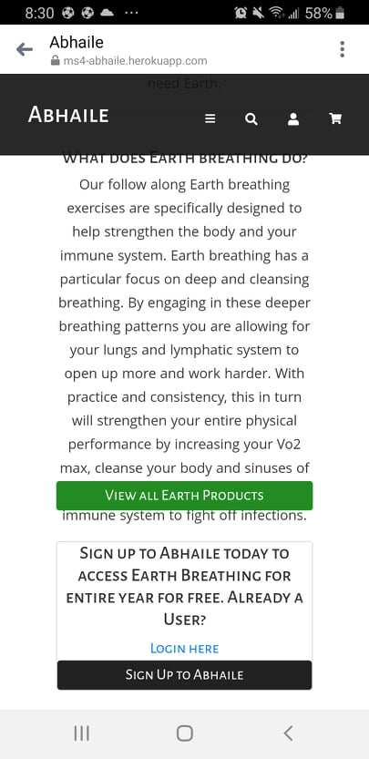
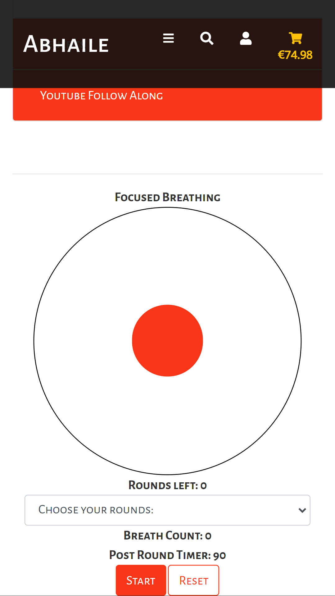
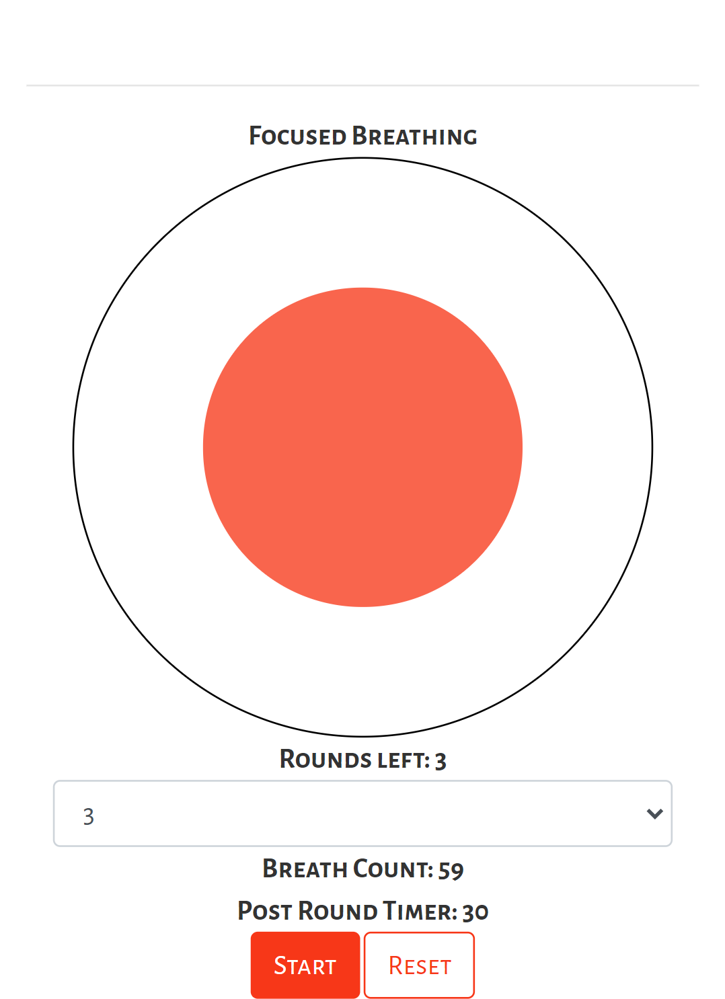
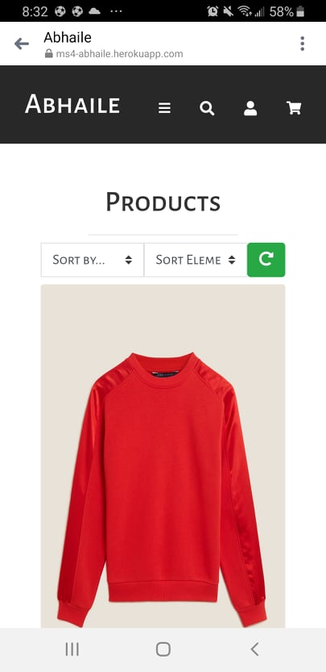
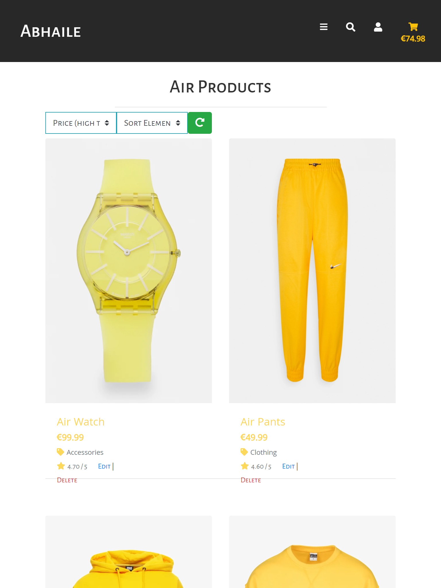
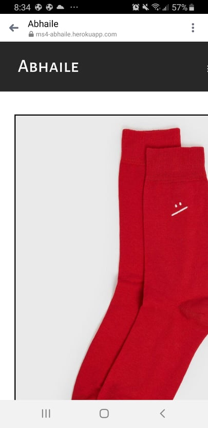
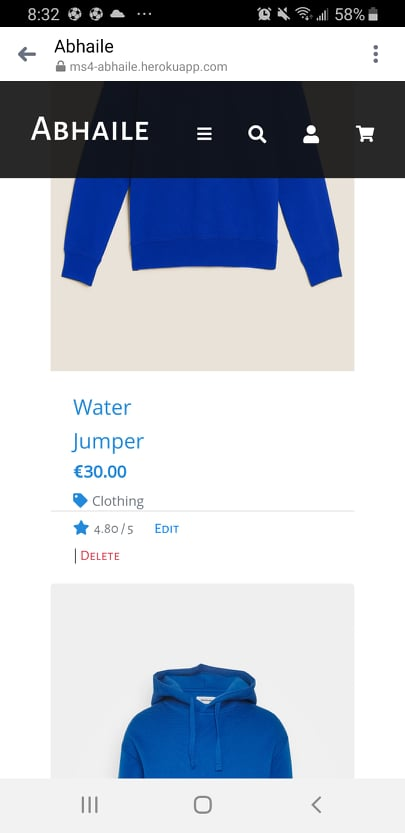
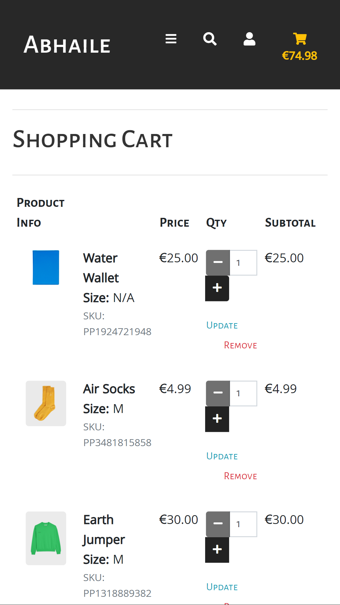

12/12/2021  
Testing was performed on a continuous basis throughout the entirety of this project.

All codes used will be put through the relevant code validators once all user testing and fixes have been complete.

## Table of Contents

- [Code Validation](#code-validation)  
- [User Stories](#user-stories)  
- [Manual Testing](#manual-testing)  
- [Site Responsiveness](#site-responsiveness)  
- [Bugs Encountered](#bugs-encountered)  
- [Outstanding Bugs](#outstanding-bugs)  

## Code Validation

- CSS passed through [W3C CSS Validator](https://jigsaw.w3.org/css-validator/validator) with no Errors found

- HTML passed through [W3C HTML Validator](https://validator.w3.org/) with all errors being fixed. Checker brought back warnings due to jinja but cant do anything to resolve this. 
 

- Javascript passed through [JS Hint](https://jshint.com/). All errors presented have now been fixed. 

- Python passed through [PEP8 Validator](http://pep8online.com/checkresult). All python code is now PEP8 compliant

## User Stories

New User:
- As a new user I want to be able to:
    -   know the exactly with this app/website is about
     

    -   know the layout of the app easily so that I can navigate the app with ease and avoid frustration
     

    -   know what the different elements mean so that I can make an informed decision on what element I want to subscribe to
     

    -   know why I should sign up and decide whether this is the app for me
     

    -   browse the online store easily so that I can purchase something I like. 
     

    -   of the health risks involved so that I don’t die 
     

Existing User:
- As an existing user I want to:
    - have my info saved so that I can purchase items from site without needing to fill out my info again
    

    - know about the different breathworks and the benefits associated with them
    

    - be guided through my breathwork so that I can better understand and learn the different breathing techniques in an engaging environment. 
     

    - be able to search appropriately so that I can better navigate and find the items I need. 
     

    - be able to access my own profile and update my information as I see fit. 
     

    - be able to access my own profile and see my previous order history 
     

Admin User:
- As an Admin user I want to:
    - be able to add products to the site
     

    - be able to edit products on the site
     

    - be able to see preview images of products I am adding before submitting on edit/add products forms
     

    - be able to add exercises to the site
     

    - be able to edit exercises on the site
     

    - be able to see preview images of exercises I am adding before submitting on edit/add exercises forms
     

## Manual Testing
- App has been tested extensively by friends and I and no reported or noticable issues or faults present. 

## Site Responsiveness
- App was passed through [Responsive Design Checker](https://responsivedesignchecker.com/) with no notable issues coming back

## Bugs Encountered
12/12/2021:  
Project Abhaile was deployed today and sent out to friends and family to test and break. 

This is what has comeback:

### Element Page issue (mobile)

- Element product and exercise buttons going over text on mobile.
- After testing further the issue is that when user is not Abhaile member, request for user to sign up is bigger than buttons involved, pushing container into above div. 
- Fix: Have introduced more marginning to help space out affected divs.

### Breath Sync not starting. 

- Since round dropdown inclusion, breath focus on exercise pages not working
- After testing further the issue is that the default value on "Choose Your Rounds" selection was set to 0 so when user attempted to start exercise, round was 0 so couldnt start
- Fix: Have now set default value to "1" so that when user doesnt select round, the exercise still starts. 

### Hold timer/Postround timer on Breath Sync not initiating at end of round

- Hold countdown timer not initiating post end of round. 
- After testing further the issue is that the Sleep JS function used at round end to pause exercise stopped entire app and so hold timer start event couldnt start.
- Fix: Have remvoved this Sleep function and instead added a new animation to mimic end round functionality. In addition, hold timer starts one rep before this hold animation starts allowing holdtimer to initiate at same time of end round pause. 

### Sort Box Issue (Resize)- Mobile display issue 

- On mobile, sort boxes not scaled down correctly. 
- Fix: Fixed by targetting select elements and bringing down font size

### Prod Image Scale - Mobile display issue

- Image container on product pages overflowing on mobile. 
- Fix: Now fixed. Introduced media queries and vh and vw sizes to better adapt to all devices

### Admin Issue - Edit/Add buttons for Products not scaling down properly

- On mobile, edit and add buttons not showing properly and overlapping down to items below
- Fix: Now fixed. Have introduced better grid structure. Edit & Delete now appearing on own row

### Cart Page Issue - Cart items appearing messy on mobile

- On mobile, items in cart not scaling down correctly on mobile. 
- Fix: Now fixed. Have introduced better media queries to account for adjusting sizes

- Common complaint that has come back is that yellow color for air pages is hard to distinguish against the white. Have added a snow color instead throughout site to combat this. 

 

## Outstanding Bugs and Encountered problems with no fix:
- The focused breath system was fully developed by me and through the use of keyframe animations, await/async and getProperty functionality was able to get this working for the most part. Unfortunately I was unable to integrate staggered breathing functions ie, one inhale leads to 10 exhales, or,inhale for 2 sec, inhale for 3 sec, inhale 2 sec, exhale for 2, exhale for 3, exhale for 2 etc. This will be looked into more post MS4 and try find a pattern that I can replicate in Javascript

- Have attempted to introduce a subscription system, spending over a week and countless hours trying to implement, but was unable to blend a sub system into the existing product system and checkout due to stripe restrictions. In hindsight, the better solution to implement both might have been to introduce the subscription system first and then blend the ecom store into it that way. Due to time and knowledge constraints I have been regretfully forced to abandon this but am eager post MS4 to get this going. 